## Description de la actividad 

#### Crear proyecto Nest utilizando el CLI de su web oficial.

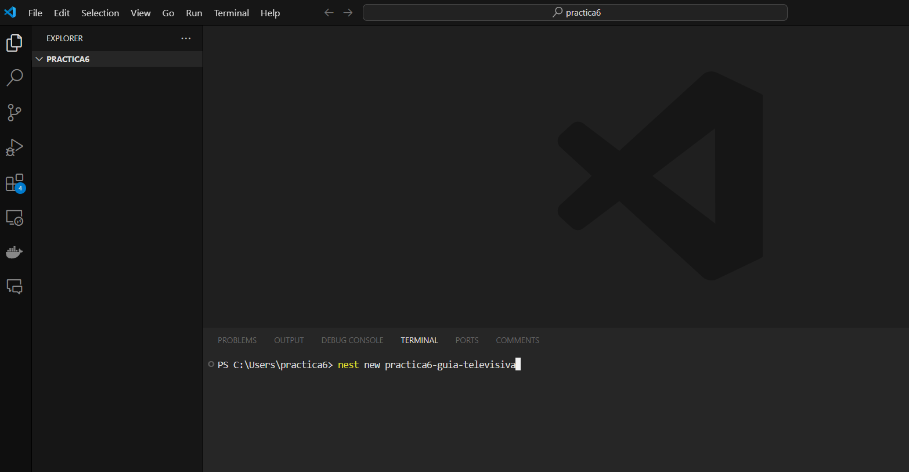
2. Definir 3 resources de tipo Rest Service para sus 3 entidades asignadas al principio del semestre.

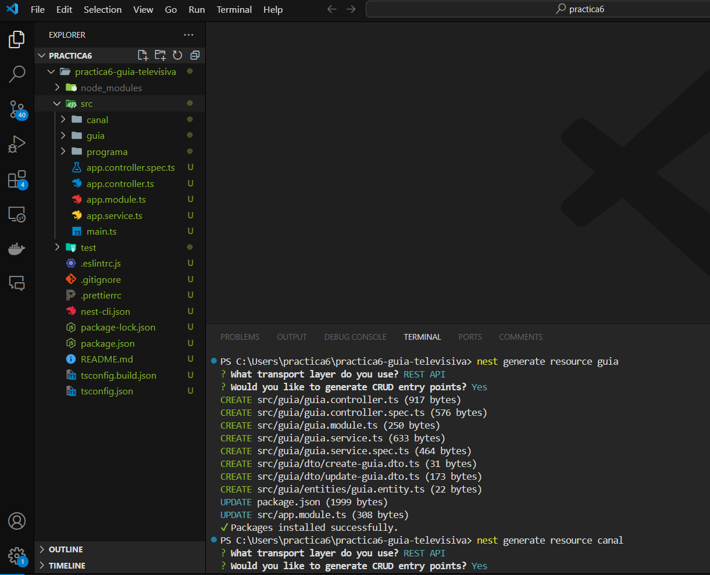
3. Definir entidades y modelos utilizando TypeORM con sus respectivas relaciones ycardinalidad.

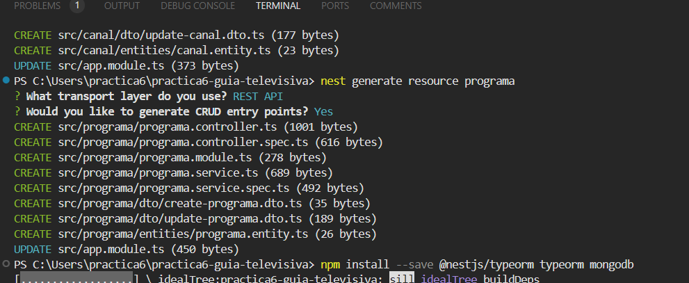
4. Adicionar el atributo ESTADO en todas sus entidades de no haberlo considerado.

5. Aplicar validaciones utilizando class-validator sobre sus DTO.

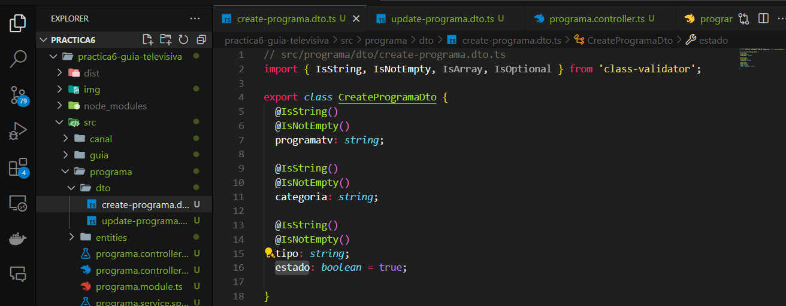
6. Definir sus servicios inyectando los respectivos repositorios por entidad y aplicar la
lógica de sus métodos CRUD asincrónicamente.
7. Implementar servicios desde sus controladores y cambiar lo que sea necesario.

8. Aprovechar la lógica en su capa de servicios para cambiar la forma de eliminación física
por lógica con el atributo ESTADO.

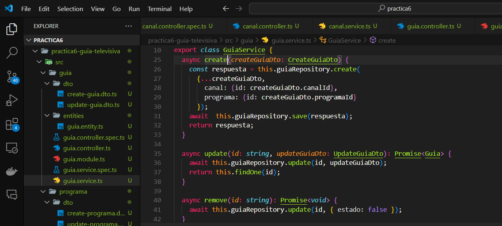
## 9. Poner a marcha su servicio REST con nestJS y evidenciar su correcto despliegue.

- Post de los servisios 

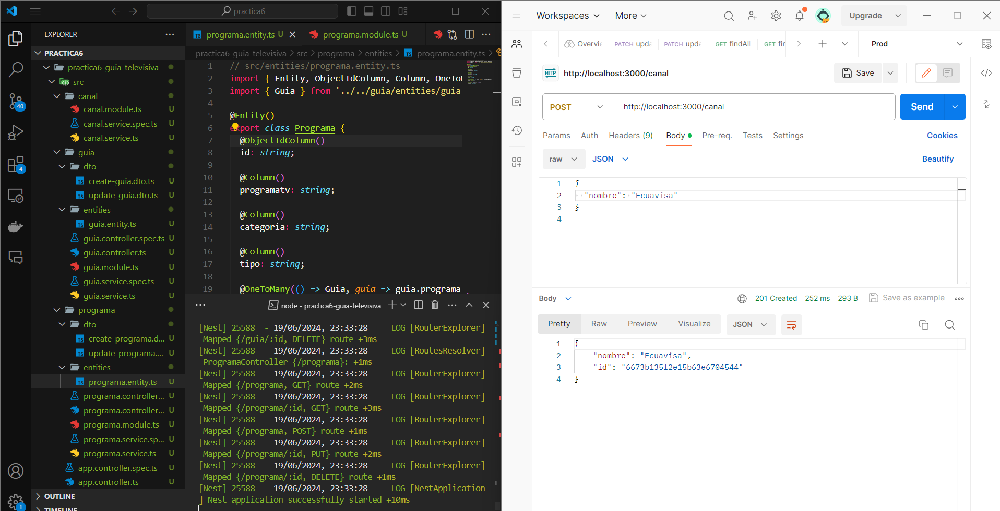
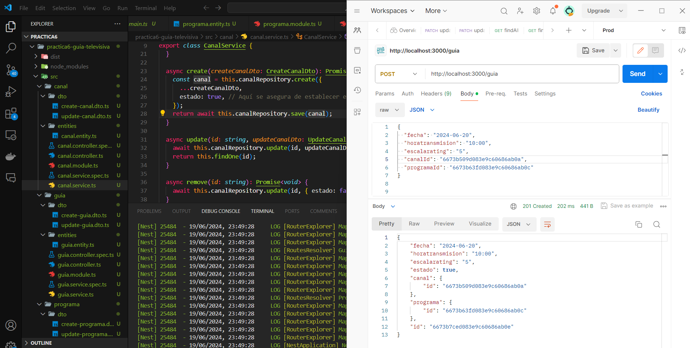

- Get delos servicios 
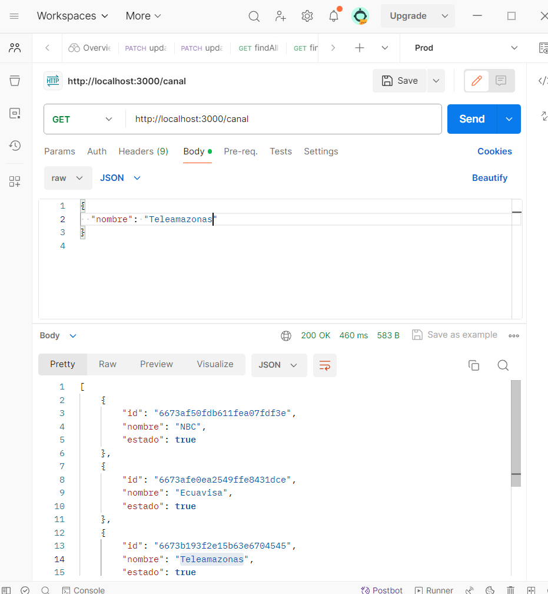
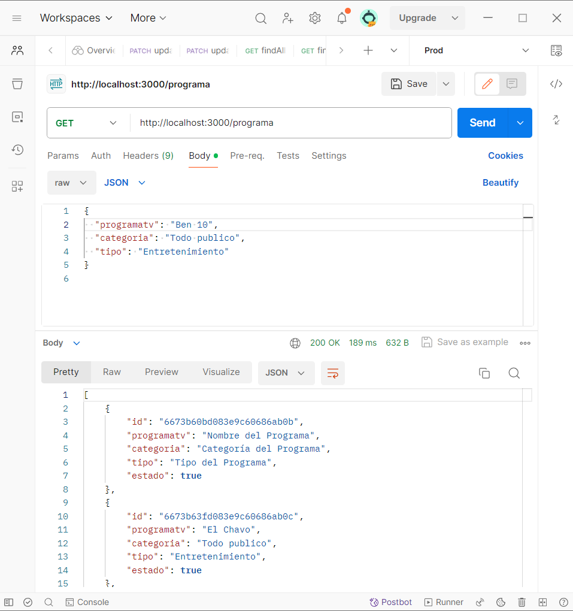
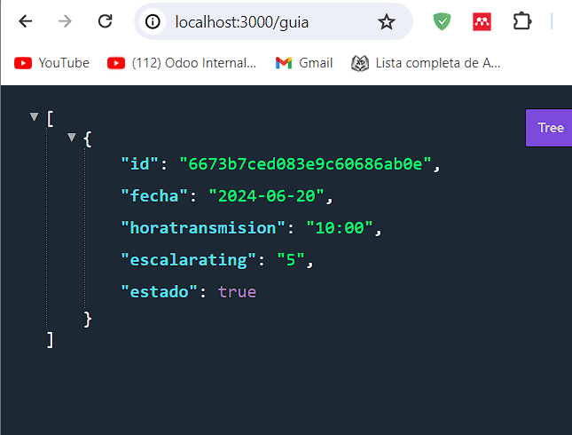

- delete logico de los servicios
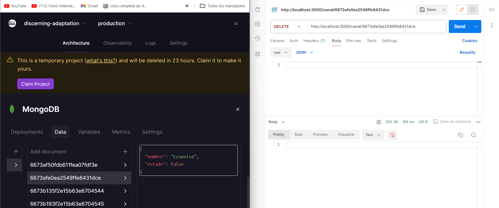
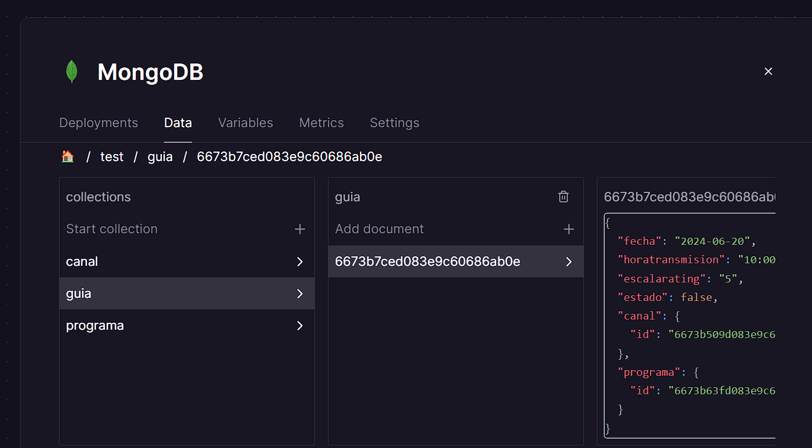

se ve en la imagen que cam io el valor del atributo a false 

- Update de los servicios
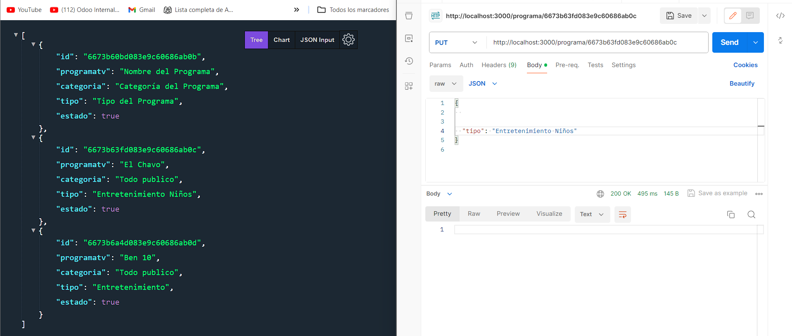
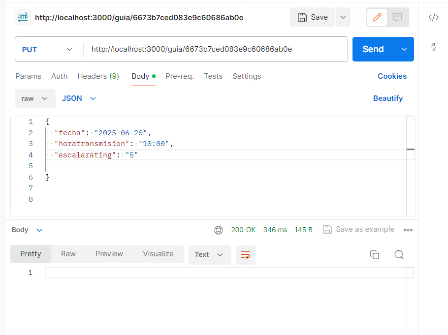

