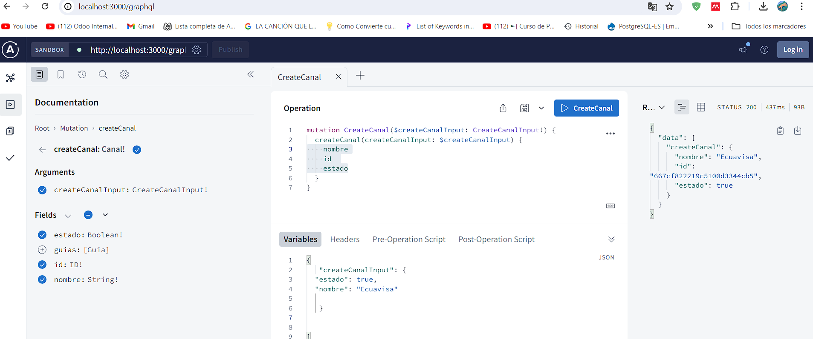
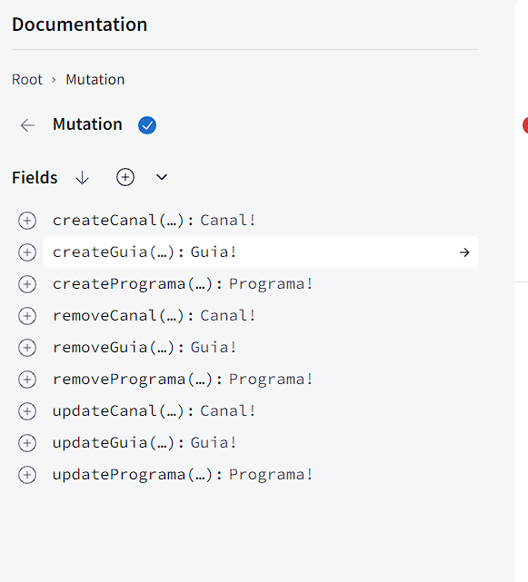
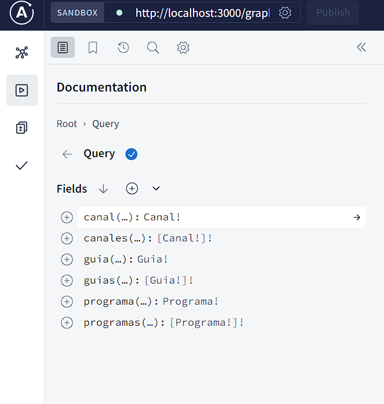
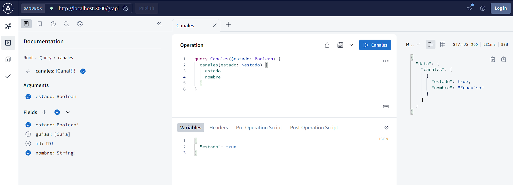

## Description de la actividad 

#### Crear proyecto Nest utilizando el CLI de su web oficial.

1. Crear proyecto Nest utilizando el CLI de su web oficial.
2. Definir Sandbox Apollo como modo para la manipulación de su esquema desde su entorno local de desarrollo.
3. Definir 3 resources de tipo GraphQL para sus entidades asignadas al principio del semestre.
4. Definir entidades y modelos utilizando TypeORM con sus respectivas relaciones y cardinalidad.
5. Adicionar el atributo ESTADO en todas sus entidades de no haberlo considerado.
6. Aplicar validaciones utilizando class-validator sobre sus DTO/INPUT.

7. Aplicar archivo de entorno dotenv para la configuración de TypeORM.

8. Definir sus servicios inyectando los respectivos repositorios por entidad y aplicar la lógica de sus métodos CRUD asincrónicamente.

9. Implementar servicios desde sus resolvers y cambiar lo que sea necesario.

10. Aprovechar la lógica en su capa de servicios para cambiar la forma de eliminación física por lógica con el atributo ESTADO.

11. Permitir al usuario en la consulta general escoger ya sea solo los elementos activos, los eliminados o todos.

12. Poner a marcha su servicio GraphQL con nestJS y evidenciar su correcto despliegue.

