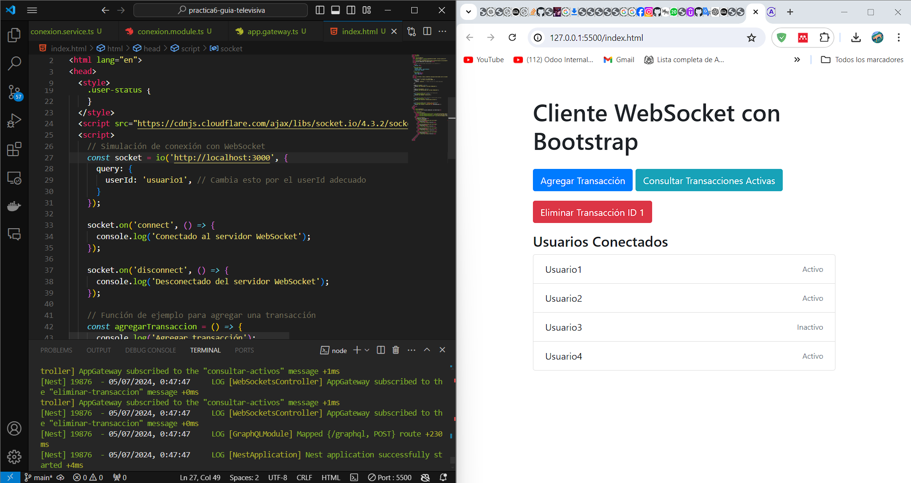
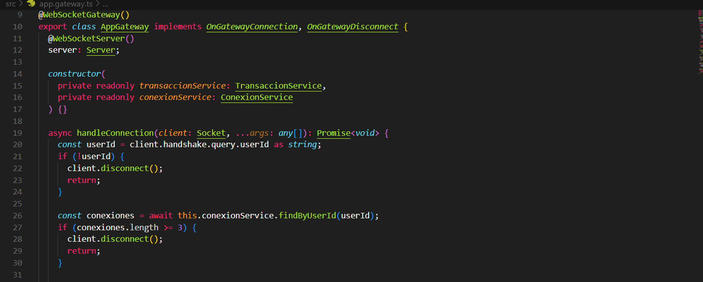

## Description de la actividad 

#### Crear proyecto Nest utilizando el CLI de su web oficial.

Crear proyecto utilizando el CLI (aplicando información de web oficial).
2. Definir recurso de tipo WebSocket.
3. Gestionar usuarios (arreglo o base de datos) y sockets (arreglo o diccionario) de su
aplicación.
4. Validar conexiones de tal manera que un mismo usuario pueda tener un máximo de 3
conexiones al mismo tiempo.
5. Implementar la lógica necesaria para que su servidor a través de @SubscribeMessage
(‘agregar-transaccion’) reciba un objeto que obedezca a la interfaz de su entidad
transaccional, proceda a insertarla en su base de datos y luego replique el objeto
insertado a todos los clientes conectados, en el cual ya conste el ID generado.
6. Agregar @SubscribeMessage(‘consultar-activos’) en el servidor, que devuelva a los
clientes conectados el listado de las transacciones activas.
7. Poner a marcha su WebSocket y evidenciar su correcto despliegue.

